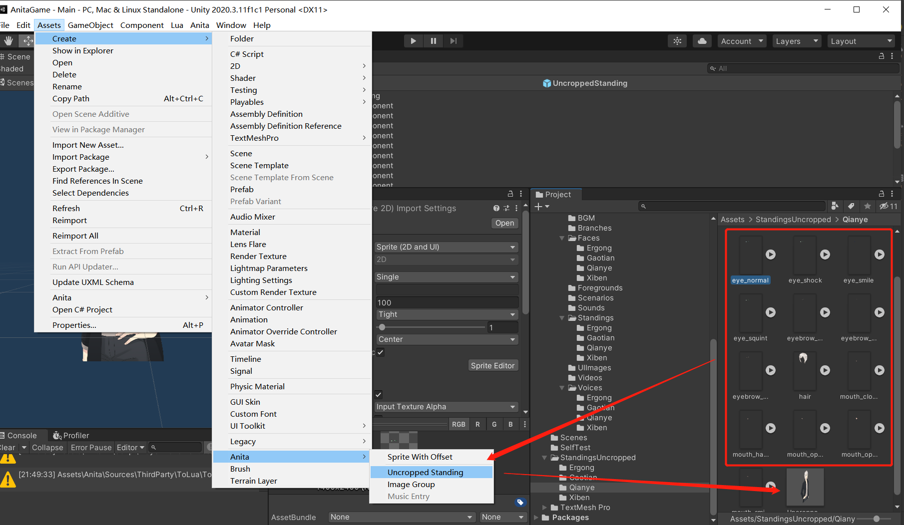
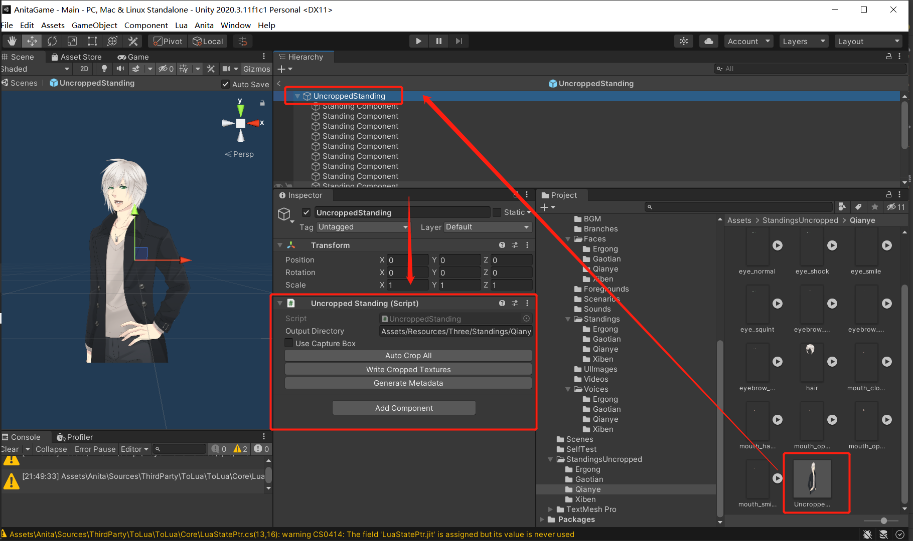
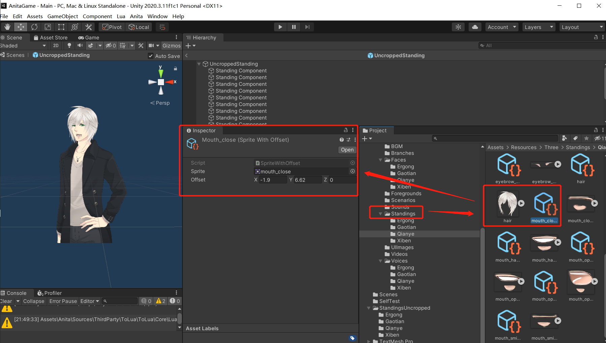

# AnitaGame
*一个基于Unity能够进行剧情演出(类AVG)的game demo，仅为个人娱乐自用.*
***

## Feature
* 立绘
* 对话
* 音乐 （bgm & 对白（.ogg））
* 剧情演出 & 分支
* 图集鉴赏
* 音乐鉴赏
* 存储等
***

## 目录
### Editor/ `编辑器相关`
1. #### Custom/ `Lua导出的相关设置`
2. #### Crop/ `裁剪立绘 & 扩展Inspector`
3. #### ImageGallery/ `图片收集`
4. #### MusicGallery/ `音乐收集`
### Sources/ `游戏功能具体实现`
1. #### Core/ `核心部分`
2. #### Exceptions/ `异常处理`
3. #### Scripts/ `业务实现`
### Fonts/ `字体`
### Lua/ `使用lua的具体业务逻辑功能的实现`
### Prefabs/ `游戏使用的prefab`
### Resources/ `游戏资源`
1. #### Locals/ `本地化语言配置`
2. #### Masks/ `mask图片，用来实现部分转场时的render texture`
3. #### Shaders/ `主要用于转场时的效果实现`
### Settings/ `一些配置`
### UI/ `UI用到的散图等`
### CGINC/ `引用到的cginc等`
***
## 部分具体实现
以下仅是关于一些具体功能的实现思路
### 立绘 & 裁剪
1. 首先导入png文件到Assets/Resources/UncroppedStanding/下，因为背景透明，所以需要进行一次裁剪
2. 因为各部分图层分开绘制，所以先生成一个各图层叠加在一起的prefab，
3. 对该prefab进行处理
    1. AutoCropAll `自动裁剪出prefab下各图层`
    2. WriteCroppedTextures `保存裁剪后各图片`
    3. GenarateMetadata `生成asset, 存储对应sprite与裁剪偏移`
4. 对应图示
   
   
   
#### Editor/Crop/ 立绘裁剪部分

