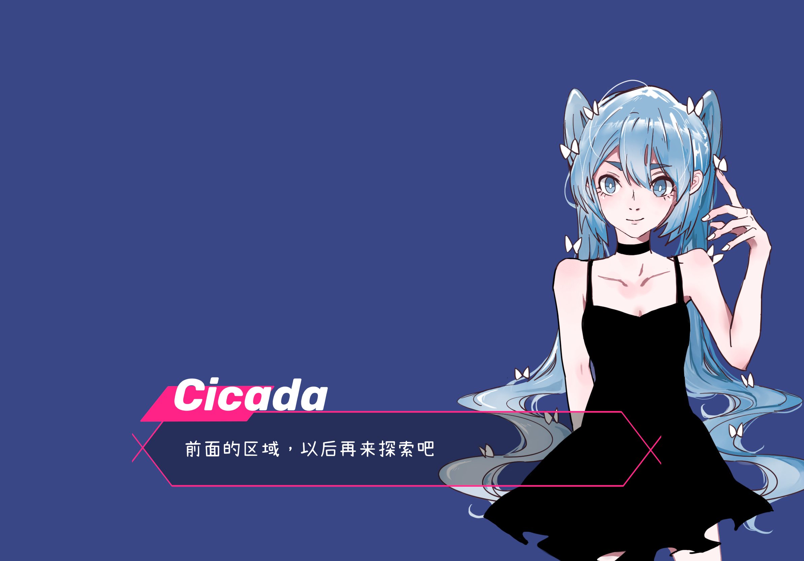
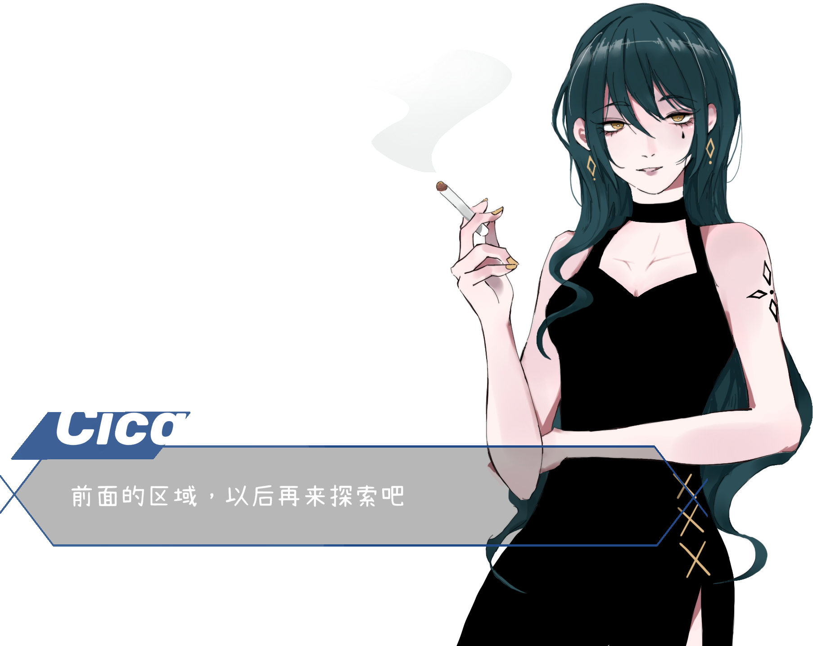

# AnitaGame
to do much

* Anita2D `暂时无用`
* AnitaAVG `AVG框架`
    * CGInc    `shader相关`
    * Editor    `编辑器相关`
    * Generate  `自动生成`
    * Lua       `自己写的lua脚本`  
    * Prefabs   
    * Scripts    `逻辑脚本`
    * Textures

本项目意在开发一个基于Unity的通用Galgame游戏框架。

[-_-]: 每一个人，因其成长环境，教育背景，过往经历，性格特点的不同，面对问题必然有个性化的处理方式。人生的方向，就植根于这每一次判断，选择和决定中，它完全由自己造就，旁人既无法掠美，更无法代受，而这无数微观的选项，汇聚成一条道路，引领你走向自己的未来，人们专门有一个词来形容它：命运。

